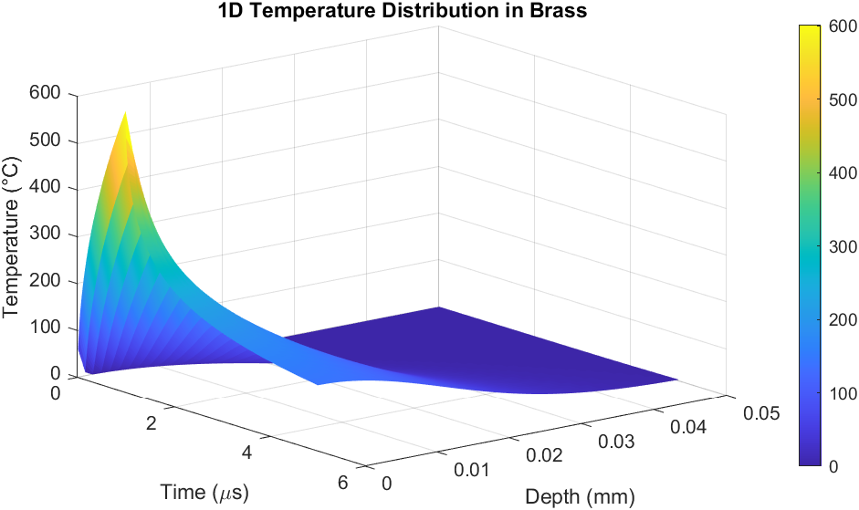
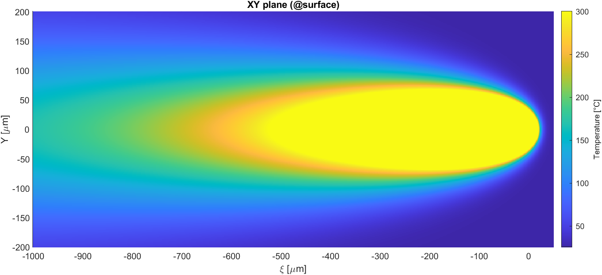
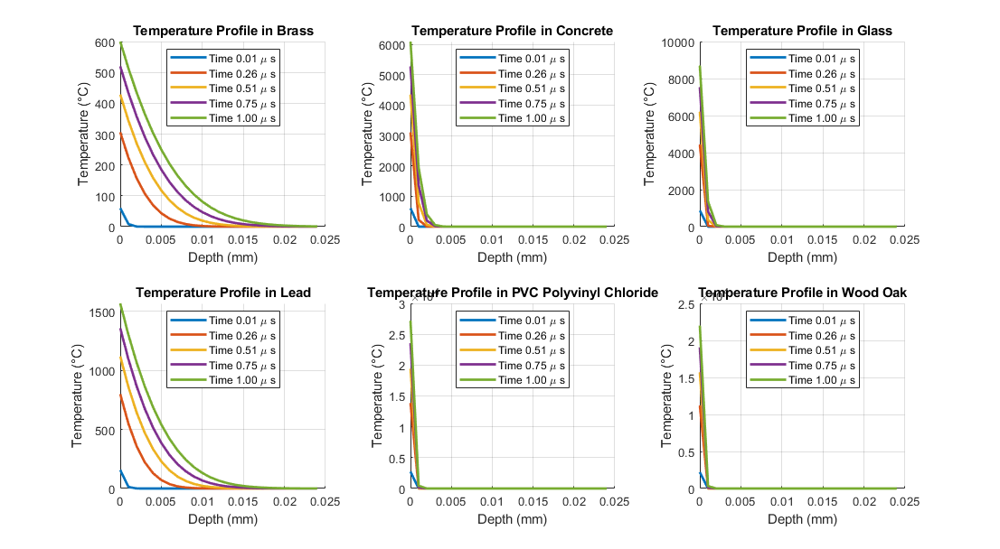
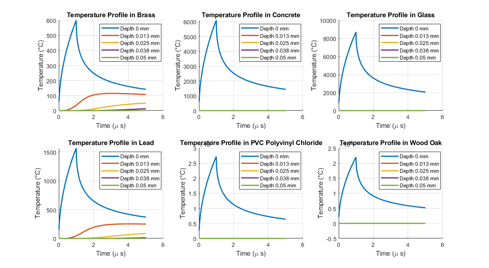
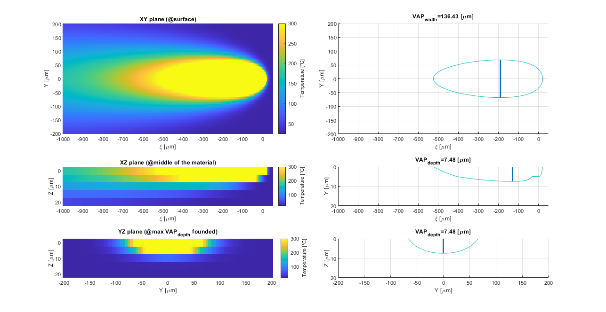

# 059168 Advanced Manufacturing Process B

A collection of MATLAB scripts for 1D and 3D thermal modeling of laser-material interaction, developed for advanced manufacturing process simulation.

<div align="center">
    
    
    <br>
    <figcaption>
        Visualizations from the 1D and 3D thermal models simulating laser-material interactions.
        In the 1D simulation, the heat source is applied at the surface (x=0) and switched off at t=1µs.
    </figcaption>
</div>


## Story

This repository is a small collection of projects I developed for the "Advanced Manufacturing Process B" course.
The curriculum was heavily focused on the use of lasers in modern manufacturing, and I found myself particularly drawn to modeling the complex thermal phenomena that occur when a high-energy beam meets a material.

These simulations were my attempt to go beyond empirical formulas and build a more intuitive understanding of the process.
They helped me determine the optimal parameters for a laser ablation task we had in the lab, balancing precision with processing speed.


## Overview

The repository contains two distinct thermal simulation models, both implemented in `MATLAB`.
The goal is to predict the temperature distribution within a material under laser irradiation.

#### 1D Thermal Model

Can be found in `Thermal_Modelling_1D.m` and focuses on a simplified scenario where the laser is treated as a motionless, extended planar heat source:

- Simulates the temperature profile along a single axis (depth) based on a motionless, extended planar heat source assumption.
- It calculates the temperature field as a function of space and time, considering only heat conduction.
- Material properties are sourced from `Thermal-Properties.xlsx`.


#### 3D Thermal Model

Can be found in `Thermal_Modelling_Moving_Point_3D.m` and simulates a moving point heat source in a 3D space:

- Simulates the temperature distribution from a moving point heat source in a 3D space.
- This model was developed to find optimal parameters for creating a PCB circuit via laser ablation.
- It helps in analyzing the volume of vaporized material to tune laser power and speed.


## Quick Start Guide

To run these simulations, you will need a working installation of `MATLAB`.
Make sure to place both the scripts and the `Thermal-Properties.xlsx` file in the same directory.

You can tune the laser and material parameters directly in the scripts before running them.


## Results and Analysis

The models produce detailed temperature profiles and visualizations of the affected material zones.

### 1D Model: Temperature Profiles

The 1D model is governed by the following relationship, describing temperature $T$ at depth $x$ and time $t$:

```math
T(x, t) = T_0 + \frac{q_0 \sqrt{4 \alpha t}}{k} \text{ierfc}\left(\frac{x}{\sqrt{4 \alpha t}}\right)
```

Where:
- $T_0$: Initial material temperature
- $q_0$: Laser heat flux
- $k$: Thermal conductivity
- $\alpha$: Thermal diffusivity
- $ierfc$: Inverse complementary error function

The plots below show the temperature evolution in different materials when the laser is active from $t=0$ to $t=1$.

<div align="center">

<br>
<figcaption>Temperature distribution as a function of depth at different points in time.</figcaption>
</div>

<br>

<div align="center">

<br>
<figcaption>Temperature distribution as a function of time at different depths.</figcaption>
</div>

### 3D Model: Melted Region Analysis

For the moving point source, the temperature $T$ at a given point is calculated using:

```math
r(\epsilon, y, z) = \sqrt{\epsilon^2 + y^2 + z^2}
```

```math
T(\epsilon, y, z) = T_0 + \frac{P \eta}{2 \pi k r(\epsilon, y, z)} \cdot \exp\left(-\frac{v}{2 \alpha} \cdot (\epsilon + r(\epsilon, y, z))\right)
```

Where:
- $P$: Laser power
- $\eta$: Absorption coefficient
- $v$: Laser scanning velocity
- $r$: Distance from the heat source

This model allows for the visualization of the melted and vaporized zones, which is critical for tuning the ablation process.

<div align="center">

<br>
<figcaption>3D representation of the melted region (light blue contour). Colors indicate the material's temperature.</figcaption>
</div>


Have a nice coding day,

Tommaso :panda_face:
